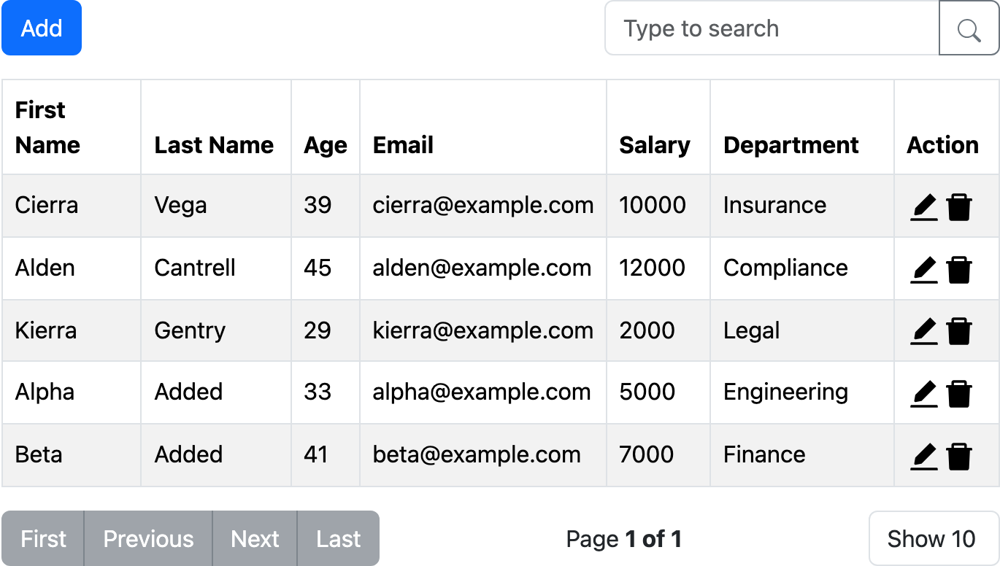
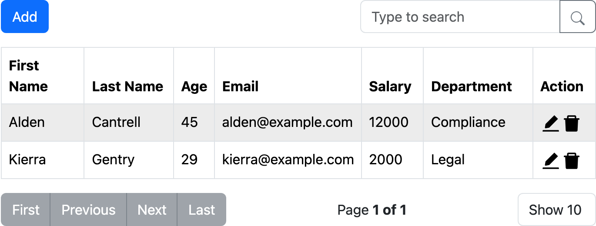
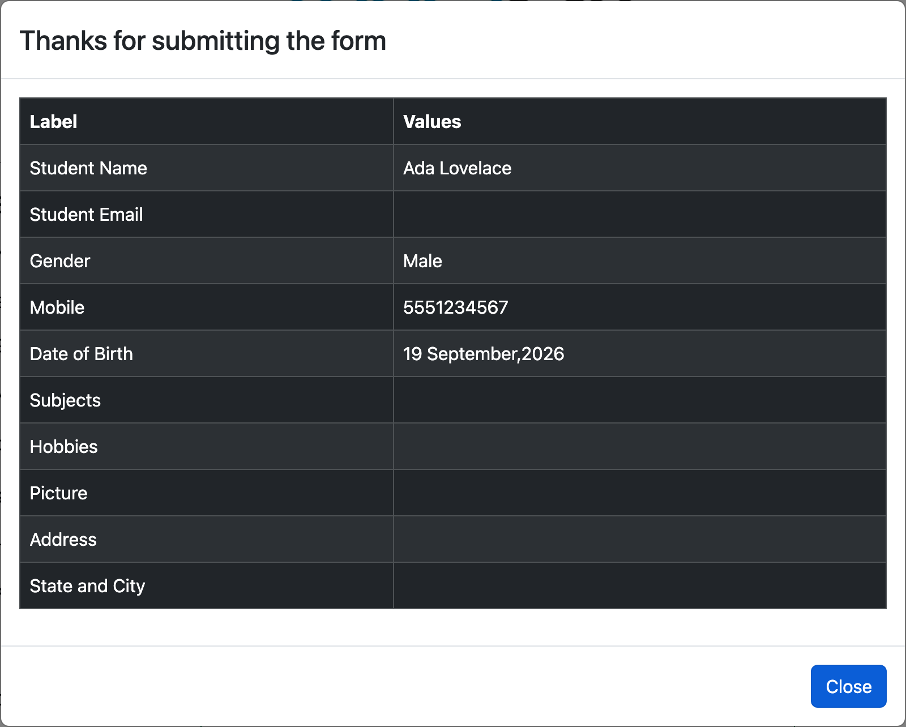
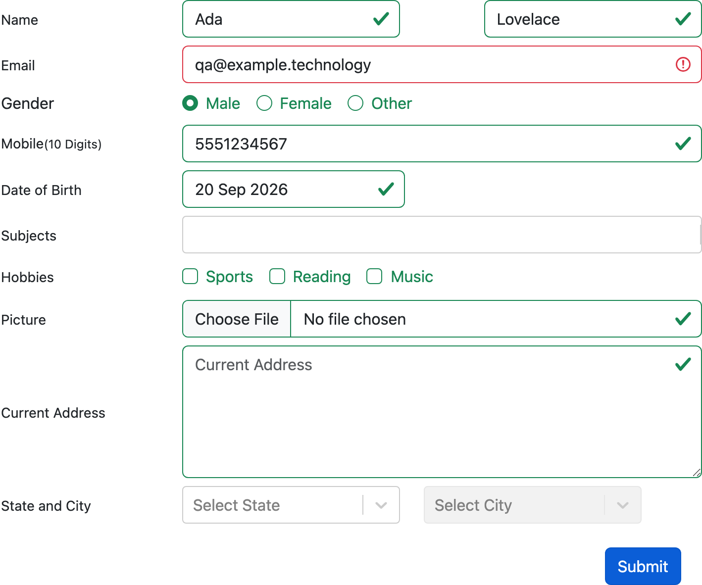
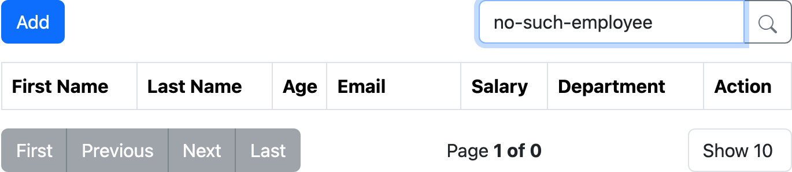
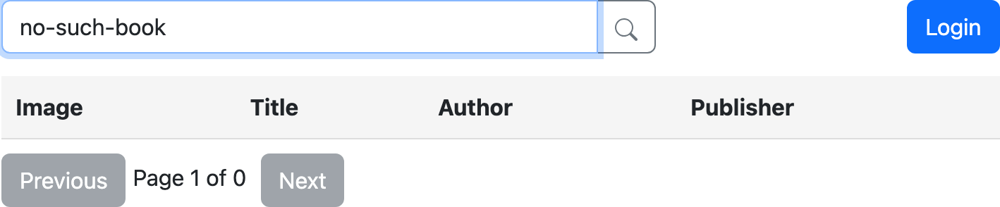
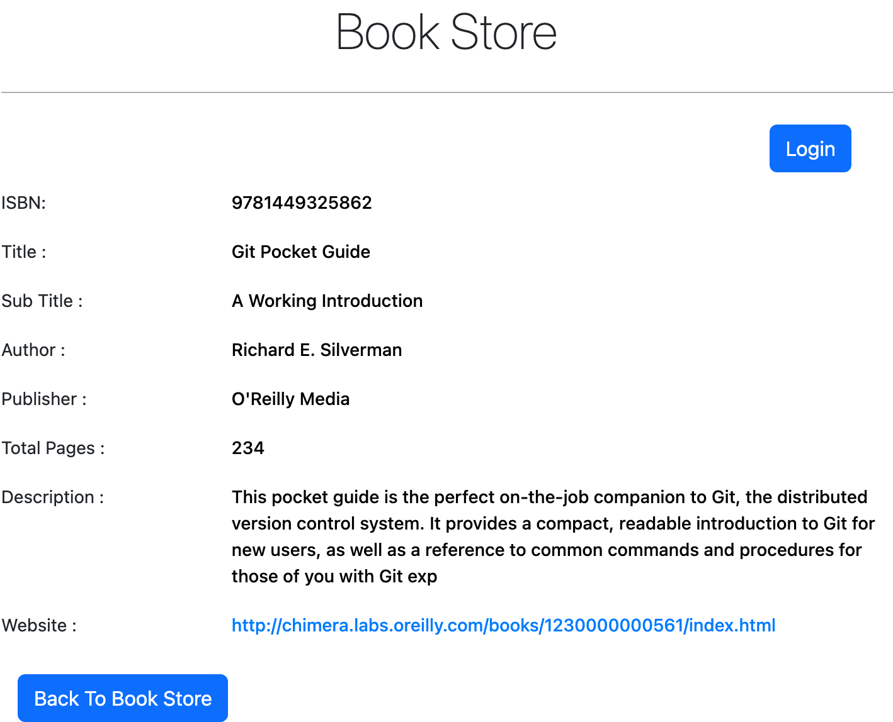

# Bug report

Eight bugs found while building the Cypress suite. None of them depends on the automation to show
up: the six UI bugs were reproduced by hand in a normal browser and their screenshots come from a
real browser session rather than a test runner; the two API bugs are reproducible with the `curl`
commands quoted in their tickets.

**Environment:** demoqa.com (production)
**Reproducibility:** 5/5 attempts for all eight bugs.

| ID                  | Area                       | Summary                                                                 | Severity | Priority |
| ------------------- | -------------------------- | ----------------------------------------------------------------------- | -------- | -------- |
| [BUG-001](#bug-001) | Web Tables                 | Deleting one record silently deletes every record added in the session  | Critical | High     |
| [BUG-002](#bug-002) | Practice Form              | Confirmation modal cannot be closed, "Close" throws a `TypeError`       | High     | High     |
| [BUG-003](#bug-003) | Practice Form / Web Tables | Valid e-mail addresses with a TLD longer than 5 characters are rejected | Medium   | Medium   |
| [BUG-004](#bug-004) | Web Tables / Book Store    | Search with no matches shows no empty state and a "Page 1 of 0" counter | Low      | Medium   |
| [BUG-005](#bug-005) | Text Box                   | "Permanent Address" is misspelled "Permananet Address" in the output    | Low      | Low      |
| [BUG-006](#bug-006) | Book Store                 | Book detail page repeats the same element `id` for every field value    | Low      | Medium   |

---

<a id="bug-001"></a>

## BUG-001: Deleting one record silently deletes every record added in the session

**Area:** Elements → Web Tables · **Severity:** Critical · **Priority:** High

### Summary

Deleting any row from the Web Tables grid also removes every record the user added during that
session. The table falls back to the seeded data set minus the deleted row. There is no warning
and no undo.

### Steps to reproduce

1. Open <https://demoqa.com/webtables>. The table starts with 3 seeded records.
2. Click **Add** and create `Alpha / Added / alpha@example.com / 33 / 5000 / Engineering`. Submit.
3. Click **Add** and create `Beta / Added / beta@example.com / 41 / 7000 / Finance`. Submit.
4. Confirm the table now shows 5 records.
5. Click the delete (bin) icon on the **Cierra Vega** row.

### Expected result

Only Cierra Vega is removed. 4 records remain, including Alpha and Beta.

### Actual result

Cierra Vega **and both added records** are removed, 2 records remain. The same happens whichever
row is deleted and whether the added records were created before or after it.

### Evidence

| Before deleting (5 records)                          | After deleting Cierra Vega (2 records)             |
| ---------------------------------------------------- | -------------------------------------------------- |
|  |  |

### Severity rationale

Silent, unrecoverable data loss from an ordinary action, with no warning and no undo. On a real
CRUD screen this is a data-integrity bug, which outranks everything else in this report.

### Notes

The resulting list is always "seeded records minus the deleted one", which suggests the delete
handler filters over a snapshot of the initial rows state captured at mount rather than over
current state, so anything added after mount is discarded on re-render.

---

<a id="bug-002"></a>

## BUG-002: Confirmation modal cannot be closed; "Close" throws a `TypeError`

**Area:** Forms → Practice Form · **Severity:** High · **Priority:** High

### Summary

After submitting the registration form, the **Close** button on the "Thanks for submitting the
form" modal does nothing except throw a JavaScript error. The modal, its backdrop and the page's
scroll lock all stay in place. Pressing **Escape** is the only way out.

### Steps to reproduce

1. Open <https://demoqa.com/automation-practice-form> and open DevTools → Console.
2. Fill the required fields: first name, last name, gender and a 10-digit mobile number.
3. Click **Submit**. The confirmation modal appears.
4. Click **Close**. Click it again.

### Expected result

The modal closes and the user is returned to the form.

### Actual result

The modal stays open on every click. The console logs
`Uncaught TypeError: Lr.findDOMNode is not a function` each time, the `.modal-backdrop` stays in
the DOM and `<body>` keeps its `modal-open` class, so the page behind cannot be scrolled or
clicked. Only Escape dismisses it.

### Evidence



### Severity rationale

The primary control on the only dialog in the flow is dead and the sole workaround, Escape, is
not discoverable. Users who do not know it are stuck behind a backdrop and have to reload. Not
Critical because no data is lost and a reload recovers the page.

### Notes

`ReactDOM.findDOMNode` was removed in React 19; the modal component (or its transition wrapper)
still calls it. Worth a codebase-wide grep, any other dialog built from the same component will
have the same failure.

---

<a id="bug-003"></a>

## BUG-003: Valid e-mail addresses with a TLD longer than 5 characters are rejected

**Area:** Forms → Practice Form **and** Elements → Web Tables (same pattern in both)
**Severity:** Medium · **Priority:** Medium

### Summary

The e-mail field's validation pattern caps the top-level domain at five letters, so valid
addresses on any longer TLD, `.agency`, `.digital`, `.museum`, `.technology`, are rejected as
malformed. The user is told their address is invalid when it is not and has no workaround.

### Steps to reproduce

1. Open <https://demoqa.com/automation-practice-form>.
2. Fill first name, last name, gender and a 10-digit mobile number.
3. Enter `qa@example.technology` in **Email**.
4. Click **Submit**.
5. Repeat with `qa@records.museum` and `hello@my.agency`.

### Expected result

All three are accepted, they are well-formed addresses on real TLDs.

### Actual result

All three are rejected: the field turns red and the form does not submit. Changing only the TLD
to `.com` submits the same form successfully. Measured against the live field:

| Address              | TLD          | Length | Accepted |
| -------------------- | ------------ | ------ | -------- |
| ada@example.co       | `co`         | 2      | yes      |
| ada@example.com      | `com`        | 3      | yes      |
| ada@example.info     | `info`       | 4      | yes      |
| qa@records.museum    | `museum`     | 6      | **no**   |
| hello@my.agency      | `agency`     | 6      | **no**   |
| qa@example.technology | `technology` | 10     | **no**   |

### Evidence



### Severity rationale

Silently locks out real users and the failure mode ("your valid address is wrong") gives them no
way forward. Medium rather than High because it affects a subset of addresses, but note the fix
has to land in two places.

### Notes

The field's pattern is `^([a-zA-Z0-9_\-\.]+)@([a-zA-Z0-9_\-\.]+)\.([a-zA-Z]{2,5})$`, the `{2,5}`
bound on the last group is the cause. The identical pattern is used by the Web Tables
registration form.

---

<a id="bug-004"></a>

## BUG-004: Search with no matches shows no empty state and a "Page 1 of 0" counter

**Area:** Elements → Web Tables **and** Book Store → book list · **Severity:** Low · **Priority:** Medium

### Summary

When a search matches nothing, the table renders its header row and nothing else, no message at
all. On Web Tables the pagination additionally reads "Page 1 of 0", which is not a valid page
range. Both search screens in the application behave the same way, so this is a shared pattern
rather than a one-off.

### Steps to reproduce

1. Open <https://demoqa.com/webtables>.
2. Type `no-such-employee` into the search box.
3. Repeat on <https://demoqa.com/books> with `no-such-book`.

### Expected result

An explicit empty state (e.g. "No rows found") and a sensible counter, "0 of 0", or no
pagination at all.

### Actual result

`<tbody>` is empty with no message, so a user cannot tell "no matches" from "still loading" or
"failed to load". The counter reads **"Page 1 of 0"**. The four navigation buttons do correctly
disable themselves, so the component knows the result set is empty, it just prints a nonsense
page number.

### Evidence

| Web Tables                                                          | Book Store                                                       |
| ------------------------------------------------------------------- | ---------------------------------------------------------------- |
|  |  |

### Severity rationale

Nothing breaks and no data is lost, so severity is Low, but every user who mistypes a search hits
it and "Page 1 of 0" reads like a crash to a non-technical user. Cheap to fix, hence the higher
priority.

### Notes

This page previously used React-Table v6, which ships a "No rows found" empty state by default.
The rewrite to a Bootstrap table dropped the message without replacing it.

---

<a id="bug-005"></a>

## BUG-005: "Permanent Address" is misspelled in the output panel

**Area:** Elements → Text Box · **Severity:** Low · **Priority:** Low

### Summary

The output panel labels the permanent address **"Permananet Address"**.

### Steps to reproduce

1. Open <https://demoqa.com/text-box>.
2. Fill **Full Name** and **Permanent Address**.
3. Click **Submit** and read the last line of the output panel.

### Expected result

`Permanent Address :<value>`

### Actual result

`Permananet Address :<value>` (element `#permanentAddress`). The same panel is also inconsistent
about spacing, `Name:` and `Email:` have no space before the colon, both address rows do.

### Evidence


### Severity rationale

Purely cosmetic, no functional impact, but it is user-visible copy on a primary page and a
one-word fix.

---

## Investigated and dismissed

Two candidates were dropped rather than reported, both worth recording:

- **8-digit mobile numbers "accepted" on the Practice Form.** The field declares `minlength="10"`
  and the form submitted an 8-digit number under Cypress. It is not a bug: Cypress's `.type()`
  sets the value without setting the input's _dirty value flag_, so the browser never evaluates
  the `minlength` constraint. Typed by hand, or by Playwright's `fill()`, the browser blocks
  submission with "Please lengthen this text to 10 characters or more". A tooling artifact, not an
  application defect. The suite therefore does not assert this rule; see "Known limitations" in
  the README.
- **Stale output panel on Text Box.** After a rejected submission the output panel keeps showing
  the previous successful submission's values. Arguably misleading, but "the panel shows the last
  successful submission" is a defensible reading, so it did not meet the bar for a report.

---

<a id="bug-006"></a>

## BUG-006: Book detail page repeats the same element `id` for every field value

**Area:** Book Store → book detail · **Severity:** Low · **Priority:** Medium

### Summary

On a book's detail page every value, ISBN, title, sub title, author, publisher, pages,
description, is rendered in a `<label id="userName-value">`. The same `id` appears 8 times and
nine further ids are duplicated on the page. Duplicate ids are invalid HTML and the name is
wrong on top of that: none of these fields is a user name.

### Steps to reproduce

1. Open <https://demoqa.com/books?search=9781449325862>.
2. Open DevTools → Console and run:

```js
const counts = {};
[...document.querySelectorAll('[id]')].forEach((el) => (counts[el.id] = (counts[el.id] || 0) + 1));
Object.entries(counts).filter(([, n]) => n > 1);
```

3. Run `document.getElementById('userName-value').innerText`.

### Expected result

Every `id` occurs at most once and names describe the field they mark (`isbn-value`,
`title-value`, `author-value`, …).

### Actual result

Ten ids are duplicated, `userName-value` × 8, plus `item-0` × 6, `item-2` × 5, `item-3` × 5,
`item-4` × 5, `item-1` × 4 and four more × 2. `getElementById('userName-value')` returns only the
ISBN, because the browser stops at the first match, so six of the eight values are unreachable by
id.

Other pages in the application (`/text-box`, `/webtables`) have no duplicate ids, so this is
localised to the Book Store rather than site-wide.

### Evidence



### Severity rationale

Nothing visibly breaks for a user, so severity is Low. Priority is higher than severity because it
is a standards violation that directly blocks automation and assistive tech: any tool that looks
up a value by id gets the ISBN regardless of which field it asked for.

### Notes

The suite works around it by scoping to the unique container ids instead
(`#title-wrapper .col-md-9 label`), which is why the Book Store tests pass despite this.

---

<a id="bug-007"></a>

## BUG-007: Missing `ISBN` parameter returns a 500 with a server stack trace

**Area:** Book Store API, `GET /BookStore/v1/Book` · **Severity:** Medium · **Priority:** High

### Summary

Calling the endpoint without its required `ISBN` query parameter returns HTTP 500 and an HTML
error page containing a full stack trace: server file paths, the ORM and the database engine. The
same endpoint validates correctly when the ISBN is present but unknown, so the validation exists.
It simply is not applied to a missing parameter.

### Steps to reproduce

```bash
curl -i 'https://demoqa.com/BookStore/v1/Book'
```

Compare with the unknown-ISBN case, which is handled correctly:

```bash
curl -i 'https://demoqa.com/BookStore/v1/Book?ISBN=not-a-real-isbn'
```

### Expected result

HTTP 400 with a JSON error, consistent with the unknown-ISBN response
(`{"code":"1205","message":"ISBN supplied is not available in Books Collection!"}`) and no
internal detail in the body.

### Actual result

`HTTP 500`, `Content-Type: text/html`, 1458 bytes:

```
Error: WHERE parameter "isbn" has invalid "undefined" value
    at MySQLQueryGenerator.whereItemQuery (/usr/projects/demosite-new/node_modules/sequelize/lib/dialects/abstract/query-generator.js:1746:13)
    at MySQLQueryGenerator.whereItemsQuery (/usr/projects/demosite-new/node_modules/sequelize/...)
```

The response discloses the absolute server path (`/usr/projects/demosite-new/`), the ORM
(Sequelize) and the database engine (MySQL).

### Severity rationale

No data is lost or exposed directly, so not High severity, but this is information disclosure
(CWE-209): an unauthenticated caller learns the stack, the directory layout and that unvalidated
input reaches the data layer. Priority is High because the fix is small (validate the parameter and return a generic error body in production) and the endpoint is public.

### Notes

The message shows the parameter reaching the query builder as `undefined` rather than being
rejected at the edge. I did not probe further than the missing-parameter case, establishing
whether anything beyond a 500 is reachable would be intrusive testing of a third-party service,
which is outside the scope of this exercise. Validating the parameter at the edge and disabling
stack traces in the error handler addresses what is visible here.

---

<a id="bug-008"></a>

## BUG-008: Failed authentication returns HTTP 200

**Area:** Book Store API, `POST /Account/v1/GenerateToken` · **Severity:** Medium · **Priority:** Medium

### Summary

Generating a token with credentials that do not belong to any account returns **HTTP 200** with a
body saying the attempt failed. Every other failure path in the same API uses an appropriate
status code, so this one endpoint is inconsistent with its own service.

### Steps to reproduce

```bash
curl -i -X POST 'https://demoqa.com/Account/v1/GenerateToken' \
  -H 'Content-Type: application/json' \
  -d '{"userName":"not_a_real_user_98765","password":"NotARealPassword@1"}'
```

### Expected result

A 4xx status, 401 for bad credentials, matching `POST /BookStore/v1/Books`, which returns
`401 {"code":"1200","message":"User not authorized!"}` when unauthenticated.

### Actual result

```
HTTP 200
{"token":null,"expires":null,"status":"Failed","result":"User authorization failed."}
```

For comparison, the same credentials against `POST /Account/v1/Authorized` return:

```
HTTP 404
{"code":"1207","message":"User not found!"}
```

### Severity rationale

No token is issued, so the endpoint is not insecure, this is a contract bug rather than an
authentication bypass, hence Medium. It matters because any client that branches on
`response.ok`, a non-2xx interceptor, or a retry policy keyed on status will treat a rejected
login as a success and only fail later on the null token.

### Notes

The suite asserts the part that is correct, that no token or expiry is issued for unknown
credentials and deliberately does not assert the status code, rather than encoding 200 as
expected behaviour. See "issues no token for credentials that do not belong to an account" in
`cypress/e2e/api/book-store.api.cy.js`.
